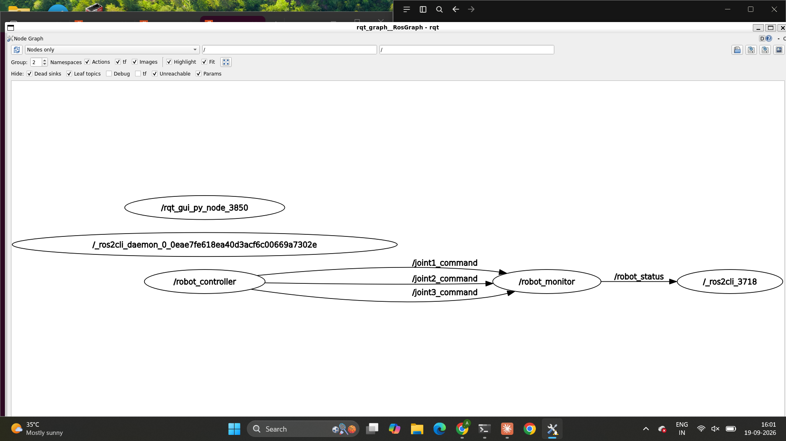
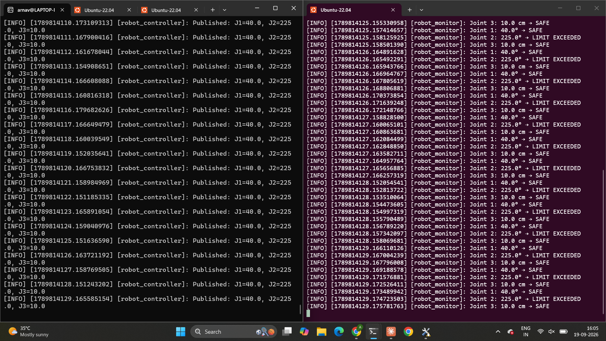
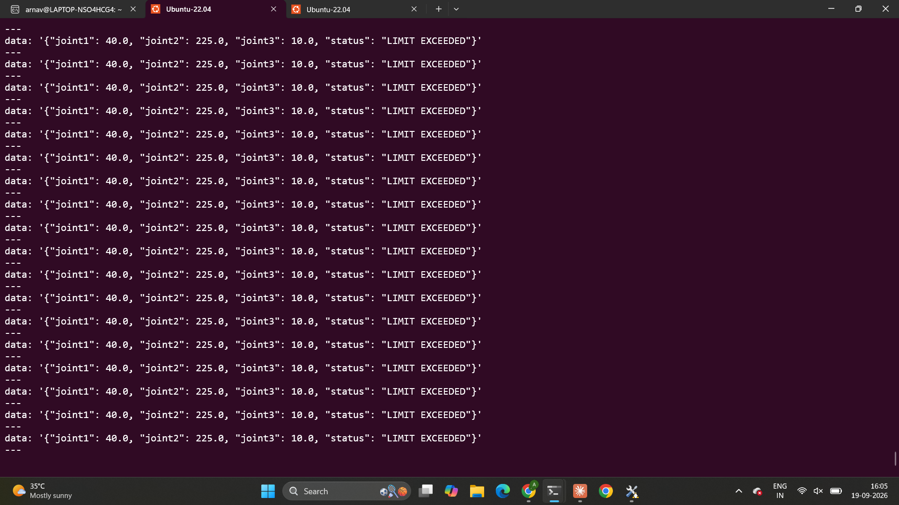

# Stark Robot Telemetry — ROS 2 Package

A ROS 2 (Humble) package implementing a two-node communication system for controlling and monitoring a simulated 3-joint robotic arm.

## Package Structure
robot_telemetry/
├── robot_telemetry/
│ ├── init.py
│ ├── robot_controller.py # Publisher node
│ └── robot_monitor.py # Subscriber + publisher node
├── resource/
├── package.xml
├── setup.py
└── setup.cfg


## Architecture

### Nodes

**`robot_controller`**
Publishes the desired position of each joint on three separate topics, once per second:
- `/joint1_command` (`std_msgs/Float64`) — Joint 1 angle, degrees
- `/joint2_command` (`std_msgs/Float64`) — Joint 2 angle, degrees
- `/joint3_command` (`std_msgs/Float64`) — Joint 3 position, cm

**`robot_monitor`**
Subscribes to all three joint command topics. On each received message, it:
- Stores the latest value for that joint
- Checks the value against its permitted range
- Logs the joint's status (`SAFE` / `LIMIT EXCEEDED`)
- Publishes a combined status message

Publishes:
- `/robot_status` (`std_msgs/String`) — a manually-formatted, JSON-style string containing all three joint values and the overall robot status, built using an f-string (no external JSON library used), e.g.:
```json
  {"joint1": 40.0, "joint2": 225.0, "joint3": 10.0, "status": "LIMIT EXCEEDED"}
```

### Joint Ranges

| Joint | Type | Range |
|---|---|---|
| Joint 1 | Revolute | 0° to 180° |
| Joint 2 | Revolute | -180° to 180° |
| Joint 3 | Prismatic | -5 cm to 20 cm |

### Design Note

No robot simulation or joint-state source was provided alongside the task. Since there is no simulated arm dynamics to introduce a difference between "commanded" and "actual" joint position, `robot_monitor` subscribes directly to the same `/jointX_command` topics published by `robot_controller`, treating commanded position as the current joint state. This is a deliberate simplification for this scope.

## Setup & Running

### Prerequisites
- ROS 2 Humble installed
- A colcon workspace (e.g. `~/ros2_ws`)

### Build

```bash
cd ~/ros2_ws
colcon build --packages-select robot_telemetry
source install/setup.bash
```

### Run

In one terminal:
```bash
ros2 run robot_telemetry robot_controller
```

In a second terminal:
```bash
source install/setup.bash
ros2 run robot_telemetry robot_monitor
```

### Inspecting topics

```bash
ros2 topic list
ros2 topic echo /robot_status
```

### Visualizing the node graph

```bash
rqt_graph
```

## Screenshots

### Node Graph (rqt_graph)


### Nodes Running Simultaneously


### /robot_status Topic Output

